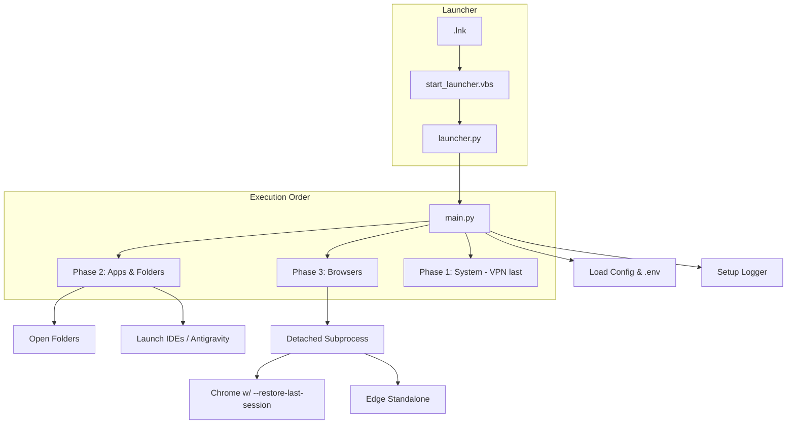

# Technical Documentation

## Architecture Overview

The application follows a **Phased Execution Model** orchestrated by `main.py`.

## Directory Structure

- `core/`: Shared utilities.
  - `config.py`: Dataclasses for strict typing configuration.
  - `retry.py`: Decorator for exponential backoff.
  - `notifier.py`: PowerShell-based Toast notifications (no extra pip dependencies required for basic toasts, though `win10toast` is listed).
- `phases/`: Logic for each step.
  - `phase1_system.py`: Uses `urllib` for connectivity checks and `subprocess` for VPN commands.
  - `phase3_browsers.py`: The most complex module.

## Deep Dive: Phase 3 (Browsers)

### Why Playwright?

We chose Playwright over Selenium because:

1.  **Speed**: It handles multiple tabs/pages significantly faster.
2.  **Stability**: `wait_for="networkidle"` is much more reliable than sleep-based waits.
3.  **Modern**: Native support for persistent contexts.

### The "Persistence" Mechanism

To ensure browser windows stay open indefinitely after the script exits, we moved away from Playwright's automation driver for the final stage. We now use **Detached Subprocesses**:

1.  The browser is launched with `--user-data-dir` and `--no-first-run`.
2.  Chromium flags like `--restore-last-session` are passed.
3.  The process is started with `subprocess.CREATE_NEW_PROCESS_GROUP | subprocess.DETACHED_PROCESS`.
4.  Standard streams are redirected to `DEVNULL` to prevent process locking.

### System Tray Launcher (`launcher.py`)

Provides a persistent background process using `pystray`.

- **Threading**: Each startup execution runs in a separate daemon thread to keep the tray UI responsive.
- **Silent Boot**: `start_launcher.vbs` uses `pythonw.exe` to hide the terminal window completely.

### Parallel Execution

When `parallel_browsers: true` is set, `ThreadPoolExecutor` is used.
**Note**: Playwright is not thread-safe if sharing the same `playwright` object across threads for _creation_ sometimes, but separate contexts are usually fine. The implementation launches separate browser instances serially or in parallel threads. Be cautious with high concurrency on low-resource machines.

## Extending the Application

### Adding a New Phase

1.  Create `phases/phase4_custom.py`.
2.  Define a class with a `run()` method.
3.  Import and instantiate it in `main.py`.

### Custom VPN Support

Modify `phases/phase1_system.py` method `_connect_vpn`. You can add support for OpenVPN or WireGuard by invoking their CLI tools via `subprocess`.
